# Schedule

**Generated from `.mi/gantt/plan.json` and `.mi/gantt/ledger.jsonl`. Do not edit by hand** — regenerate with `/mi-gantt`. Progress is a fold of the ledger, so the numbers here are true as of the last run and nowhere else.

| | |
|---|---|
| Tasks | **6** (0 done, 0 scheduled, 1 held, 5 blocked) |
| Serial effort | **12 agent-hours** |
| Parallel wall-clock | **≈ 0 hours** at cap 2 |
| Critical path | `p0-foundation → p1-scope → p5-adoption` (≈ 9h) |
| Hard blocker | **p0-foundation** — needs the human |

```mermaid
gantt
    title Schedule — parallel wall-clock (agent-hours)
    dateFormat X
    axisFormat %s
    todayMarker off

    section Held
    p0-foundation needs the human :done, held_p0_foundation, 0, 1
```

## Waves

| Wave | Tasks | Agents | Gate |
|---|---|---|---|

## Held — not scheduled, and blocking what follows

| Task | Why | Blocks |
|---|---|---|
| p0-foundation P0 — foundation: git init, condemn scaffold, one crate/manifest, distribution decision | needs the human | p1-scope, p2-content-id, p3-clock, p4-stats |

## Checks that need a human at a terminal

- **p0-foundation** — Human must answer the distribution-mechanism question framed in .mi/docs/memos/distribution.md (git dependency pinned by commit + vendored offline cache, vs. fully vendored copy) before status there can read decided; git init/initial commit is itself a one-time repo-state change worth a human's eyes since no version control exists yet.
- **p1-scope** — Confirm the one consumer build proof (mitosys depending on conserved through the p0-decided distribution mechanism, in mitosys's own tree/container) actually happened and record the commit, since that half of acceptance lives outside this repo and cargo test here cannot see it.
- **p5-adoption** — Each consumer swap (mitosys util/effect and SHA-256 ids, llm Scope/Clock/min_median_max adoption, realm Scope/ContentId adoption) happens in sibling repositories (/Users/feb/dev/infra/mitosys, /Users/feb/dev/infra/model, /Users/feb/dev/infra/realm) outside this repo's tree and its own board/gate — a human should confirm those trees' own gates (mitosys just check in its offline container in particular) actually go green against the real conserved dependency, not a stub.

## Audit findings — unrepaired

The adversary returned **REPAIR FIRST**. These findings are recorded verbatim and are *not* fixed in `plan.json`. Read them before trusting the schedule above.

### Lost work

- p5 load proof, in-repo, unplaced and unfootprinted — .mi/prd/p5-adoption/prd.md:41-43: "**The load proof** — the crate must hold its contract at scale (README vision §4): `ContentId` hashing throughput and `Scope` unwind-under-panic exercised in a bench/test recorded in `conserved` itself, before mitosys's record depends on them." This is the one requirement of p5 that lands in THIS repo, and the plan gives p5 `files: []` on the stated theory that "the substantive writes land in sibling repos". Nothing writes conserved/benches/ or conserved/tests/, and p5's verify is `echo ...`, which exits 0 unconditionally. The run reports p5 green with the load proof never written.
- ContentId serde is specified and placed nowhere — learnings/content-addressing.md:77: "Serde: bytes on a binary wire, hex string in JSON, so a record stays readable by eye where it is already JSON." The p2 node names this learning as its spec (.mi/prd/p2-content-id/prd.md:11-13) and the board says specs live in learnings/, not in the nodes (.mi/prd/prd.md:12-14). No task carries serde. Worse, it is a live contradiction: adding it adds a second dependency against p2's "**The one dependency** — `blake3` enters the crate here" (.mi/prd/p2-content-id/prd.md:29) and shared-crate.md:107 "One crate to start, with one dependency (`blake3`)". An afk p2 worker will silently pick one side and mitosys's record will be typed around whatever it picked.
- Closing the learnings is prescribed and placed nowhere — AGENTS.md:149: "**Close** — update the learning status to `decided`, link to the commit." learnings/shared-crate.md is `status: partial` and learnings/clock.md is `status: open`; both are extracted to completion by p1-p5 and neither status flip is in any task. README.md:39-40 renders those same statuses in a table that goes stale with them. p0 correctly carries the distribution memo's flip to `decided`; the same treatment for the two learnings is missing. Note `learnings` is declared a shared file owned by no task, so nobody picks this up by accident.
- p0's acceptance check is not in p0's verify — .mi/prd/p0-foundation/prd.md:48-49: "`cargo build --workspace && cargo test --workspace` passes **from a fresh clone** of this repository". The plan's p0 verify runs the gate in place plus `git rev-parse --git-dir`. In-place green proves nothing about a clone (untracked files, .gitignore, missing members all pass in place and fail on clone), and the clone property is exactly what p1's whole reason for existing depends on ("does the dependency resolve, on a fresh clone", .mi/prd/p1-scope/prd.md:19-20). No task clones and builds.

### Invented

- p1's named port source is narrower than the real module. The plan's notes assert the source is "/Users/feb/dev/infra/mitosys/src/mitosys/util/effect/{effect.rs,tests/effect.rs} (262 lines, zero deps)". On disk that directory is a crate: effect.rs (154), tests/effect.rs (89), lib.rs (19), Cargo.toml (16), README.md (57). 154+89 is 243, not 262 — the spec's 262 only reconciles if lib.rs is counted, and lib.rs is the module wiring the plan does not name. A worker porting only the two named files ports the crate without its own surface declaration and without the README that documents the unwind contract p5 must load-test.
- p0's `files` entry `.git/` is not a footprint. It is neither a file the task writes through the editor nor a path any other task could collide on; it is the side effect of `git init`. Harmless, but it is the only entry in the whole plan that does not name a real writable path, and it makes p0's footprint look wider than it is.
- No task invents a requirement its spec does not ask for — I checked each spec line against each task and found no added scope. The failures here are omissions and mismarks, not fabrication.

### Edges

- MISSING and real: p1-scope -> p2-content-id. p1's verify is `cargo tree -p conserved --edges normal | grep -cv conserved | grep -qx 1` — it asserts the crate's normal-dependency edge count. p2 adds blake3 to conserved/Cargo.toml. Under the plan both have deps [p0-foundation] only, so they are schedulable in the same wave; the moment p2 lands, p1's gate can no longer go green, and if p1 is still open it fails for a reason that has nothing to do with p1. The p1 spec itself anticipates the ordering in .mi/prd/p1-scope/prd.md:31-32: "`Scope` must not drag `blake3` in transitively (**it cannot yet — p2 has not landed** — keep it that way when it does)". The plan's stated reasoning for omitting the edge examines the wrong direction: it checked whether p2 needs p1 and concluded no. The breakage runs p2 -> p1.
- MISSING and real: p1/p2/p3/p4 must be serialized (or given a lib.rs merge owner) because this is NOT a git repo. The profile states plainly: no claim lock, no worktree isolation, no rollback. All four tasks list `conserved/src/lib.rs` and `conserved/Cargo.toml`. max-workers is 2 (.mi/prd/prd.md:5), so two of them WILL run concurrently under deps [p0] alone, both editing the `mod`/`pub use` block of the same lib.rs with no lock and no way back. Either add p1->p2, p2->p3, p3->p4 chain edges, or declare conserved/src/lib.rs a shared no-owner file with a defined append step — but the plan does neither.
- OVER-CONSTRAINED against its own source: p5's deps [p1,p2,p3,p4]. The node says the opposite in .mi/prd/p5-adoption/prd.md:16: "Blocked on p1–p4 **per module** — adopt each module as it lands, **do not wait for all four**." The plan acknowledges the line and then models the barrier anyway because "a finer per-module-per-consumer breakdown was not given ids by the source document". That is a reason to derive sub-tasks, not a reason to invert the instruction: the all-four barrier serializes every consumer adoption behind the slowest extraction, which is the exact cost the node wrote that sentence to avoid.
- Also flagging p1's verify command as likely broken as copied: for a zero-dependency crate, `cargo tree -p conserved --edges normal` prints only the `conserved v0.1.0 (...)` root, so `grep -cv conserved` emits `0` and `grep -qx 1` fails. It comes verbatim from .mi/prd/p1-scope/prd.md:5 so it is not the plan's invention, but the plan adopted it unexamined and p1 can never go green on it. Worth settling before p1 is dispatched.

### Collisions

- p1-scope, p2-content-id, p3-clock, p4-stats all list `conserved/src/lib.rs` — correct as a footprint, fatal as a schedule. Their deps are identical ([p0-foundation]), so the frontier will dispatch two at once into the same file with no lock and no rollback. Same problem, same four tasks, on `conserved/Cargo.toml` (p2 adds blake3; p2's "Property tests on the round-trip" per .mi/prd/p2-content-id/prd.md:21 likely adds a dev-dependency too).
- p5-adoption: `files: []` is wrong. The node requires a bench/test "recorded in `conserved` itself" (.mi/prd/p5-adoption/prd.md:41-43), which is conserved/benches/ or conserved/tests/ plus a `[[bench]]`/`[dev-dependencies]` stanza in conserved/Cargo.toml — none listed. .mi/prd/p5-adoption/prd.md:35-36 anticipates more: "if adoption forces a `conserved` change, that change was a missing requirement, not realm's problem" — i.e. p5 is expected to write conserved/src/ as well. An empty footprint means p5 collides with anything scheduled alongside it and is invisible to the collision check.
- No task lists the learnings files it must edit — learnings/shared-crate.md and learnings/clock.md frontmatter status, and the README.md:31-41 status table that mirrors them. Consistent with the lost-work item above; recording it here too because these are shared, owner-less files and two tasks touching them concurrently is the same unlockable conflict.
- p0-foundation's footprint is otherwise sound — I checked each path it names against disk: conserved/, conserved-core/, conserved-alloc/, conserved-net/, conserved-deriv/, conserved-derive/, Cargo.toml and .mi/docs/memos/distribution.md all exist and all are named in .mi/docs/memos/scaffold-reset.md:11-14 and .mi/prd/p0-foundation/prd.md:23-27. It also needs to remove the now-empty conserved/doc/ directory, which is inside the listed conserved/ prefix.
- Placement checks out: all six `node` values resolve on disk (.mi/prd/p0-foundation … p5-adoption each hold a prd.md), and no task carries `node: ""`. Separately confirming the surveyor's structural note with a correction — .mi/workflows and .mi/skills are not empty directories, they are 908/912-byte macOS alias stubs pointing at /Users/feb/dev/infra/.mi/*, so laws.md and worker.md genuinely cannot be read from this repo.
